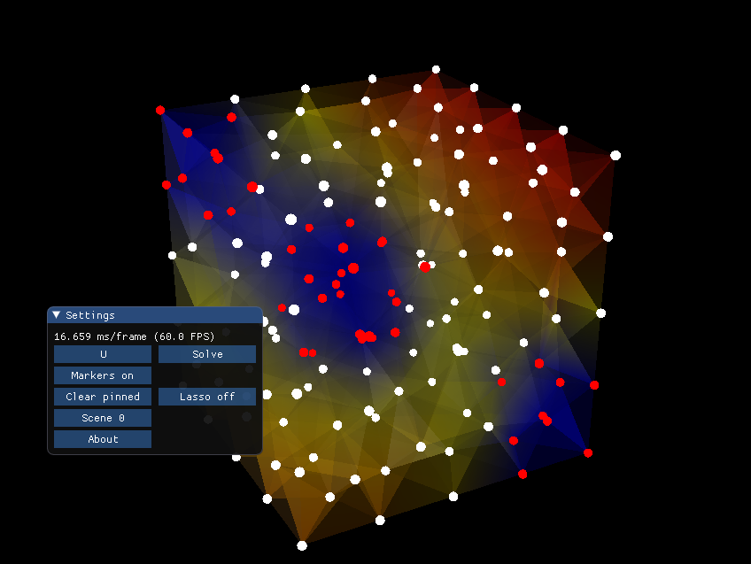

## Fem3D - A solver for Laplacian in 3D

This project is an effort to demonstrate the capabilities of the finite element method in 3D. The project is written mainly in C++ and OpenGL trough Magnum.  
Try it online here: http://envall.xyz/fem3d/  



To build the project you need Magnum installed on your system. Magnum is split into a number of separate modules. Magnum also supports WebGL as the rendering backend and WASM via Emscripten.  
Here is what is needed for the desktop build:

SDL2 (prebuilt or from source)  
https://github.com/ocornut/imgui.git  (v1.66b for WASM build)

https://github.com/mosra/corrade.git  
https://github.com/mosra/magnum.git  
https://github.com/mosra/magnum-plugins.git  
https://github.com/mosra/magnum-extras.git  
https://github.com/mosra/magnum-integration.git  

This project has been developed against the "v2019.01" branch of the above repositories. Pre-built packages can be found for Arch can be found in AUR. "build.sh" might be useful when building from source.

Before the first build you also need a mesh file, see instructions below. After all dependencies are in place this project can be built the common way:

```
mkdir build
cd build
cmake -DImGui_INCLUDE_DIR=PATH/TO/IMGUI/REPOSITORY ..
make -j
```

#### Mesh generation
Mesh generation is out of the scope for this project. Two MATLAB scripts are included for generating and saving tetrahedron meshes in a simple ASCII format. In order to have this project also WASM ready, the files are built into the final binary.

The MATLAB script can be run in batchmode with
```
matlab -nodesktop -nosplash -nodisplay -r "createMesh('cube.stl',0.5);exit"
```
